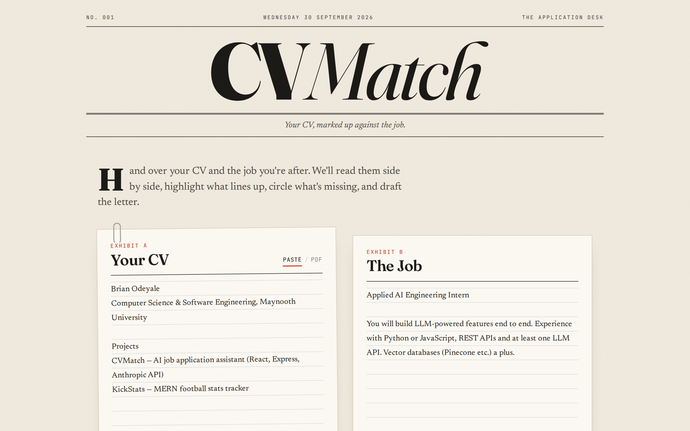
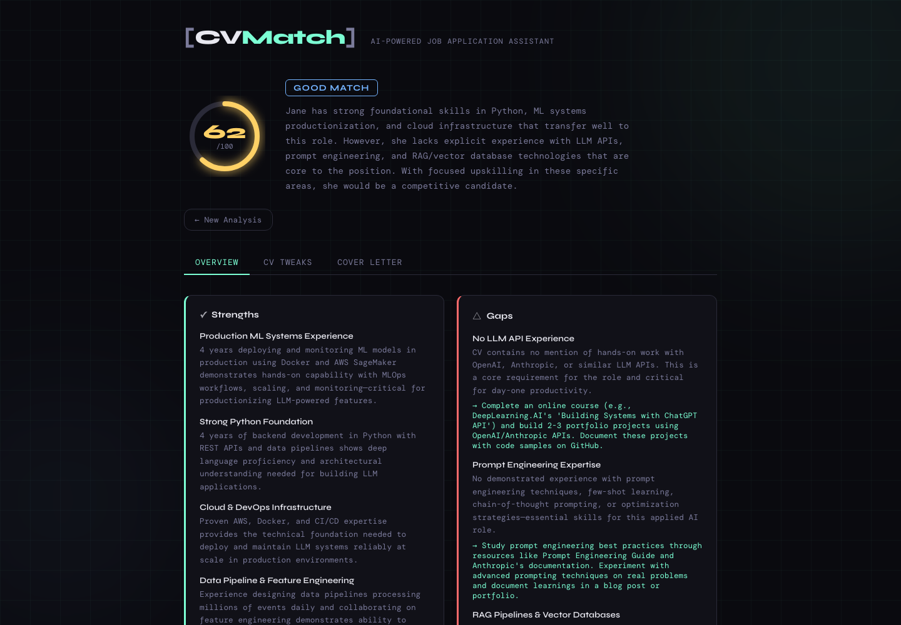

# CVMatch 🎯

An AI-powered job application assistant that analyses your CV against a job description, scores the match, surfaces skill gaps, suggests CV improvements, and generates a tailored cover letter — all in seconds.

Built with React, Node.js/Express, and the Anthropic Claude API.

  




---

## Features

- **Match Score** — 0–100 score, circled in red pen
- **Verdict** — Strong / Good / Partial / Weak match classification
- **Strengths** — What makes you a great fit for the role
- **Gap Analysis** — Missing skills/experience with actionable fixes
- **CV Tweaks** — Section-by-section improvement suggestions
- **Cover Letter Generator** — Tailored cover letter ready to copy
- **PDF Upload** — Upload your CV as a PDF or paste as text

---

## Tech Stack

| Layer | Technology |
|-------|-----------|
| Frontend | React 18, CSS custom properties (editorial "red pen" design: Fraunces, Newsreader, JetBrains Mono, Caveat) |
| Backend | Node.js, Express |
| AI | Anthropic Claude API (claude-haiku-4-5) |
| PDF Parsing | pdf-parse |
| File Uploads | Multer |

---

## Getting Started

### Prerequisites
- Node.js 18+
- An [Anthropic API key](https://console.anthropic.com/)

### Installation

```bash
# 1. Clone the repo
git clone https://github.com/brianodeyale64/cvmatch.git
cd cvmatch

# 2. Install all dependencies (root + client)
npm run install:all

# 3. Set up environment variables
cp .env.example .env
# Add your Anthropic API key to .env
```

### Running Locally

```bash
npm run dev
```

This starts both the Express server (port 5050) and React dev server (port 3000) concurrently.

> **Note:** on macOS, port 5000 is often held by the AirPlay Receiver (System Settings → General → AirDrop & Handoff), which is why the default port here is 5050 instead.

Open [http://localhost:3000](http://localhost:3000) in your browser.

---

## Project Structure

```
cvmatch/
├── server/
│   ├── index.js              # Express app entry point
│   └── routes/
│       └── analyse.js        # Claude API integration & PDF parsing
├── client/
│   ├── public/
│   │   └── index.html
│   └── src/
│       ├── App.js
│       ├── components/
│       │   ├── Header.js
│       │   ├── InputForm.js  # CV + job description input
│       │   └── Results.js    # Score, strengths, gaps, cover letter
│       └── index.css
├── .env.example
└── package.json
```

---

## Environment Variables

| Variable | Description |
|----------|-------------|
| `ANTHROPIC_API_KEY` | Your Anthropic Claude API key |
| `PORT` | Server port (default: 5050) |

---

## How It Works

1. User pastes their CV (or uploads a PDF) and a job description
2. The Express server extracts text from the PDF if needed
3. A structured prompt is sent to the Claude API asking for a JSON analysis
4. Claude returns match score, strengths, gaps, CV tweaks, and a cover letter
5. The React frontend renders the results as a single marked-up review page: the verdict, strengths and gaps, CV edits, and the cover letter

---

## License

MIT
